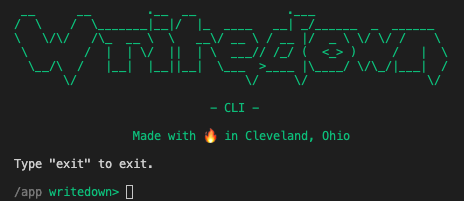

# The Official Writedown Parser and Command Line Interface



## Overview

This project is the official [Writedown](https://github.com/cliffordoravec/writedown) parser and command line interface, written in Python.

## Installing

This project can be used as either a command line tool or as a Python module.

### Installing the Standalone Command Line Tool

If you are a writer looking to just manage your Writedown projects, you'll want to install the standalone command line tool, available as an installer in this project's [Releases](releases/) (Coming Soon).

### Installing the Python Module

If you are a developer and want to install the parser and command line tool for use with Python, you have a couple of options.

#### Installing from GitHub source

1. Clone the repository using git or download and extract a ZIP file
2. If you're using a virtualenv, switch to it.
3. From the project directory, run `python -m pip install .`

## Using

### Using the Standalone Command Line Tool

Once installed, you can run "writedown" from any command prompt, or create a shortcut to the executable.  If you create a shortcut, be sure to provide at least one argument, such as "shell" to launch an interactive session.

### Using the Python Module

#### Invoking the Command Line Tool from the Python Module

To invoke the CLI tool from the Python module, run
`python -m writedown.cli <arguments>`

#### Using the API

Comprehensive API documentation is available in the [docs](docs/) directory of this project, as well as through pydoc.

A simple usage example follows:

```python
from writedown.parser import Parser
from writedown.commands import Commands

# Create a parser and parse some Writedown
parser = Parser()
doc = parser.parse_doc_from_path(BOOK_PATH)

# You can then access the AST directly
chapters = doc.find(ChapterNode)

# Or, more conveniently, you can create a Command object and use its methods
commands = Commands(doc)
info = commands.info()
```

## Arguments

### -h, --help

The **-h** and **--help** arguments show help and usage information, including available commands:

```
usage: writedown [-h] [-p path]
                 {about,characters,export,info,init,locations,preview,sessions,shell,status,tags,targets,todo,wordcount,wc,version} ...

Manage writing projects using Writedown.

options:
  -h, --help            show this help message and exit
  -p path, --path path  Project file or directory path. If none is provided, defaults to the current directory. If a directory is provided,
                        uses Writedown file discovery logic.

commands:
  {about,characters,export,info,init,locations,preview,sessions,shell,status,tags,targets,todo,wordcount,wc,version}
    about               Show information about this program
    characters          Show character usage in the current project
    export              Export the current project
    info                Show top-level information about the current project
    init                Initialize a new project in the current path
    locations           Show location usage in the current project
    preview             (shell) Shows a preview of the document
    sessions            Show sessions in the current project
    shell               Launch an interactive shell
    status              Show statuses in the current project
    tags                Show tags in the current project
    targets             Show actual vs. target wordcounts in the current project
    todo                Show todo items in the current project
    wordcount (wc)      Show reading time, page count, wordcount, and character count statistics in the current project
    version             Shows the program version

Run 'writedown COMMAND --help' for more information on a command
```

### **-p** path, **--path** path

Specifies the project file or directory path. If none is provided, defaults to the current directory. If a directory is provided, uses Writedown file discovery logic.

## General Commands

Writedown supports the following commands from both the command line and interactive shell.

### info

The **info** command shows basic structural information about a Writedown document, including:
1. The Title
2. The Author
3. The number and types of structural nodes (Act, Part, Chapter, Scene, Section)
4. The number and types of definition nodes (Character, Place)
5. The number and types of informational nodes (Location, Tag, Todo, Comment, Note)

Sample usage:
```
writedown> info
```
```
A Work In Progress
by Jack Writer
1 part
3 chapters
2 scenes
2 locations
1 character
1 place
2 tags
3 todos
1 comment
```

### wordcount, wc

The **wordcount** command (shortcut **wc**) shows the number of pages, words, and characters in a document at its structural levels, including the amount of time it would take to read each structural level.

Sample usage:
```
writedown> wordcount
writedown> wc
```
```
                                                             reading time      pages      words      chars
A Work In Progress                                                0:01:11          1        326       2072
-- Part 1                                                         0:01:11          1        326       2072
---- Chapter 1: Writer's Block                                    0:01:11          1        326       2072
------ Scene 1: Realizations at the coffee shop                   0:00:52          1        239       1516
------ Scene 2: Escape through the parking lot                    0:00:18          0         87        556
---- Chapter 2                                                    0:00:00          0          0          0
---- Chapter 3                                                    0:00:00          0          0          0
```

### characters

The **characters** command shows which characters appear at the different structural levels of a document, and how many times each character is referenced.

Sample Usage:
```
writedown> characters
```
```
                                                             characters
A Work In Progress                                           
-- Part 1                                                    
---- Chapter 1: Writer's Block                               
------ Scene 1: Realizations at the coffee shop              Jack (2)
------ Scene 2: Escape through the parking lot               Jack (1)
---- Chapter 2                                               
---- Chapter 3                        
```

### locations

The **locations** command shows which locations appear at the different structural levels of a document.

Sample Usage:
```
writedown> locations
```
```
                                                             locations
A Work In Progress                                           
-- Part 1                                                    
---- Chapter 1: Writer's Block                               
------ Scene 1: Realizations at the coffee shop              Farbucks
------ Scene 2: Escape through the parking lot               Farbucks Parking Lot
---- Chapter 2                                               
---- Chapter 3                    
```

### status

The **status** command shows the status of structural levels in a document.

Sample Usage:
```
writedown> status
```
```
                                                             status    
A Work In Progress                                                     
-- Part 1                                                              
---- Chapter 1: Writer's Block                               draft     
------ Scene 1: Realizations at the coffee shop              draft     
------ Scene 2: Escape through the parking lot                         
---- Chapter 2                                               new       
---- Chapter 3    
```

### tags

The **tags** command shows the tags associated with structural levels in a document.

Sample Usage:
```
writedown> tags
```
```
                                                             tags
A Work In Progress                                           
-- Part 1                                                    
---- Chapter 1: Writer's Block                               
------ Scene 1: Realizations at the coffee shop              awesome, good
------ Scene 2: Escape through the parking lot               
---- Chapter 2                                               awesome, stuck
---- Chapter 3                                               
```

### todo

The **todo** command shows todos defined in the document.

Sample Usage:
```
writedown> todo
```
```
A Work In Progress                                          
-- Part 1                                                   
---- Chapter 1: Writer's Block                              
------ Scene 1: Realizations at the coffee shop             
-------- tests/books/wip.wd:16           [TODO] What should we name the barista?
------ Scene 2: Escape through the parking lot              
-------- tests/books/wip.wd:26           [TODO] Should this take place in the parking lot or the bathroom?  How does he get the key?
---- Chapter 2                                              
------ tests/books/wip.wd:32             [TODO] Left off here
```

### targets

The **targets** command shows wordcount targets defined in the document.  It shows the target wordcount, the actual wordcount, and the delta of actual minus target for each structural level of the document.

Sample Usage:
```
writedown> targets
```
```
                                                                 target     actual      delta
A Work In Progress                                                    -        326          -
-- Part 1                                                             -        326          -
---- Chapter 1: Writer's Block                                      326        326          0
------ Scene 1: Realizations at the coffee shop                       -        239          -
------ Scene 2: Escape through the parking lot                        -         87          -
---- Chapter 2                                                     2000          0      -2000
---- Chapter 3                                                        -          0          -
```

### sessions

The **session** command shows sessions defined in the document.  For each session, the following information is displayed:
1. The location of the session definition
2. The date of the session
3. The title of the session
4. The target wordcount of the session
5. The actual wordcount of the session
6. The delta wordcount (actual minus target) of the session

Sample Usage:
```
writedown> sessions
```
```
                                                                                            target     actual      delta
tests/books/wip.wd:13                    05/10/2022 At the coffee shop, hahaha                 200        239        +39
tests/books/wip.wd:24                    05/11/2022                                            100         87        -13
tests/books/wip.wd:36                                                                         1000          0      -1000
```

### export

The **export** command enables a user to export a Writedown document to various output formats.

Sample Usage:
```
writedown> export draft [file]
writedown> export text
writedown> export pdf [file]
writedown> export strip
writedown> export dump
```

## Shell Commands

Writedown supports additional commands in its interactive shell mode.

### **shell**

Launches an interactive shell.

### **help**, **help** \<command\> (shell)

Shows help and usage information, including available commands from within the shell.

To get additional help about a command, you can pass the command name: `help <command>`

### **exit**

Exits the shell.

### **cd** \<path\>

Changes the current project path to the given path.

### **dir** \[path\], **ls** \[path\]

Lists the contents of the project path.

### **edit** \[path\]

Edit the contents of a path using the program defined in the EDITOR environment variable.

### **path**, **pwd**

Shows the current project paths.

### **preview**

Shows a preview of the document.

### **show** \[path\], **cat** \[path\]

Shows the contents of a path.

## Roadmap

Additional features are planned for this project including:

1. Installation through pip
2. Installers for Windows, MacOS, and Linux
3. Exporting to additional formats, including .DOCX, .EPUB, and .MOBI
4. Supporting user-defined export templates

## More Information

More information about the Writedown language and functional specification for Writedown tools can be found at the [Writedown project site](https://github.com/cliffordoravec/writedown).

## Credits

Created by Clifford Oravec.

## License

Writedown is licensed under the terms of the GNU LGPLv3 license.